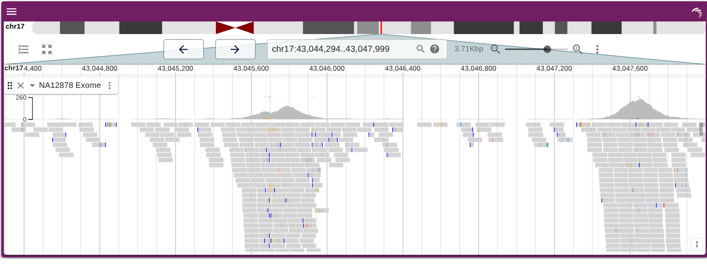
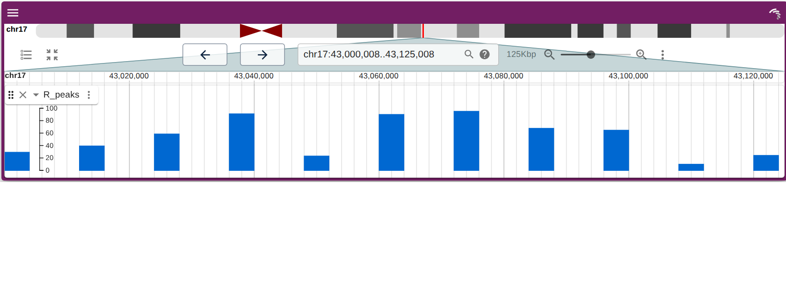

<!-- README.md is generated from README.Rmd. Please edit that file -->

```{r, include = FALSE}
knitr::opts_chunk$set(
  collapse = TRUE,
  comment = "#>",
  fig.path = "man/figures/README-",
  out.width = "100%"
)
```

# JBrowseR 

<!-- badges: start -->
[](https://github.com/gmod/JBrowseR/actions)
[](https://CRAN.R-project.org/package=JBrowseR)
[](https://colab.research.google.com/github/GMOD/JBrowseR/blob/main/examples/JBrowseR_colab.ipynb)
<!-- badges: end -->

JBrowseR provides an R interface to the [JBrowse 2](https://jbrowse.org/jb2/)
genome browser. It renders the interactive, GPU-accelerated JBrowse 2 linear
genome view as an [htmlwidget](https://www.htmlwidgets.org/), so you can embed a
full genome browser in an **R Markdown** document, a **Shiny** app, or straight
from the **R console**.

The API is declarative: you describe the browser with plain values, and helper
constructors build the config. There are no JSON strings to assemble and nothing
imperative to wire up.

```r
library(JBrowseR)

# an entire human genome browser in one line — assembly, reference name
# aliases, cytobands, and gene-name search all included
JBrowseR("hg38", location = "BRCA1")
```

## Installation

Released version from [CRAN](https://CRAN.R-project.org):

``` r
install.packages("JBrowseR")
```

Development version from [GitHub](https://github.com/GMOD/JBrowseR):

``` r
# install.packages("remotes")
remotes::install_github("GMOD/JBrowseR")
```

## Quick tour

Point at a hub genome by name and add tracks by URL — the track type and its
index files are inferred automatically.

```r
JBrowseR(
  "hg38",
  tracks = tracks(
    track(
      "https://jbrowse.org/genomes/GRCh38/alignments/NA12878/NA12878.alt_bwamem_GRCh38DH.20150826.CEU.exome.cram",
      name = "NA12878 Exome"
    )
  ),
  location = "17:43,044,295..43,048,000"
)
```



View results you computed in R directly on the genome — no files, no web server:

```r
peaks <- data.frame(
  chrom = "17",
  start = seq(43000000, 43120000, by = 12000),
  end   = seq(43000000, 43120000, by = 12000) + 4000,
  name  = paste0("peak", 1:11),
  score = round(runif(11, 5, 100))
)

JBrowseR(
  "hg38",
  tracks = list(track_data_frame(peaks, "R_peaks")),
  location = "17:43,000,000..43,125,000"
)
```



## Getting started

See the vignettes:

- [Introduction](https://gmod.github.io/JBrowseR/articles/JBrowseR.html) — the
  declarative API and a gallery of demos
- [Custom browser tutorial](https://gmod.github.io/JBrowseR/articles/custom-browser-tutorial.html)
  — build a browser for your own assembly and data
- [Serving local data](https://gmod.github.io/JBrowseR/articles/creating-urls.html)
  — view files on your machine
- [Full JSON config](https://gmod.github.io/JBrowseR/articles/json-tutorial.html)
  — the escape hatch for complete control

## Citation

If you use JBrowseR in your research, please cite:

[Hershberg et al., 2021. JBrowseR: An R Interface to the JBrowse 2 Genome Browser](https://doi.org/10.1093/bioinformatics/btab459)

```
@article{hershberg2021jbrowser,
  title={JBrowseR: An R Interface to the JBrowse 2 Genome Browser},
  author={Hershberg, Elliot A and Stevens, Garrett and Diesh, Colin and Xie, Peter and De Jesus Martinez, Teresa and Buels, Robert and Stein, Lincoln and Holmes, Ian},
  journal={Bioinformatics}
}
```

## For developers

The R package ships a prebuilt JavaScript bundle in `inst/htmlwidgets/`. To
rebuild it against a local checkout of
[jbrowse-components](https://github.com/GMOD/jbrowse-components) (expected as a
sibling directory), install [pnpm](https://pnpm.io) and run:

```
git clone https://github.com/GMOD/JBrowseR
cd JBrowseR
pnpm install
pnpm build       # writes inst/htmlwidgets/JBrowseR.js and .css
R -e 'devtools::install()'
```
