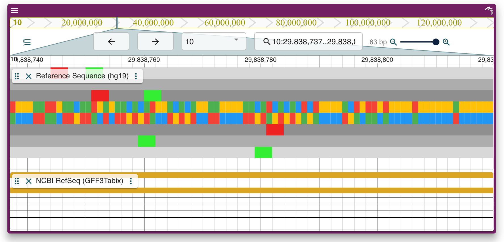

<!-- README.md is generated from README.Rmd. Please edit that file -->

# JBrowseR 

<!-- badges: start -->

[](https://github.com/elliothershberg/JBrowseR/actions)
<!-- badges: end -->

JBrowseR is an R package that provides a simple and clean interface to
[JBrowse 2](https://jbrowse.org/jb2/) for R users. Using JBrowseR, you
can:

-   Embed the JBrowse 2 genome browser in **R Markdown** documents and
    **Shiny applications**
-   Deploy a genome browser directly from the R console to view your
    data
-   Customize your genome browser to display your own data

With this functionality, you can deploy a first-class genome browser
with your data in just a few lines of R code!

## Installation

You can **soon** install the released version of JBrowseR from
[CRAN](https://CRAN.R-project.org) with:

``` r
install.packages("JBrowseR")
```

And the development version from [GitHub](https://github.com/) with:

``` r
# install.packages("devtools")
devtools::install_github("elliothershberg/JBrowseR")
```

## Example

This line of code can be used to launch a genome browser from your R
console:

``` r
library(JBrowseR)
JBrowseR("ViewHg19",
        location = "10:29,838,737..29,838,819")
```



## Getting started

In order to get started with JBrowseR, please refer to the vignette that
best suits your needs:

-   [Introduction](https://elliothershberg.github.io/JBrowseR/articles/JBrowseR.html)
-   [Custom browser
    tutorial](https://elliothershberg.github.io/JBrowseR/articles/custom-browser-tutorial.html)
