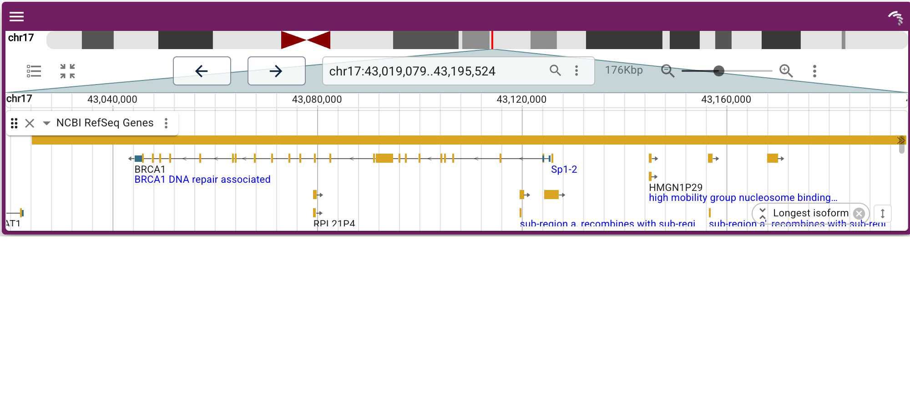
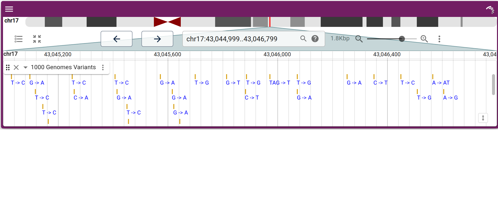
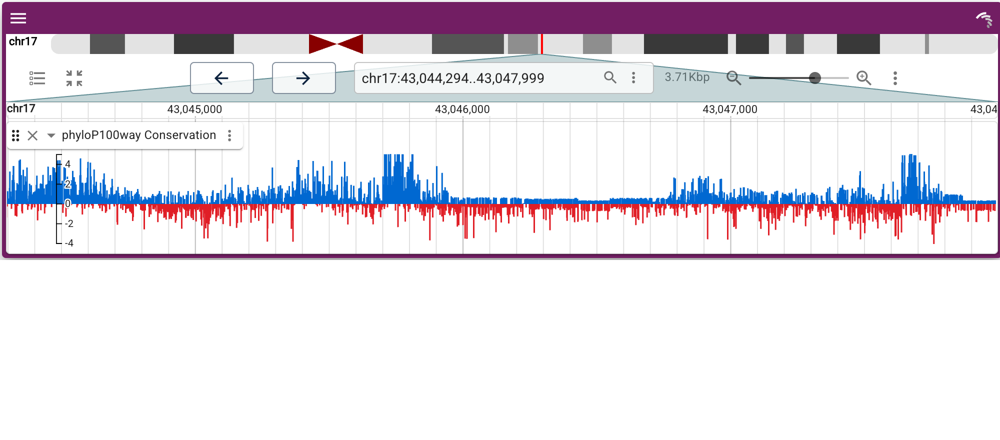
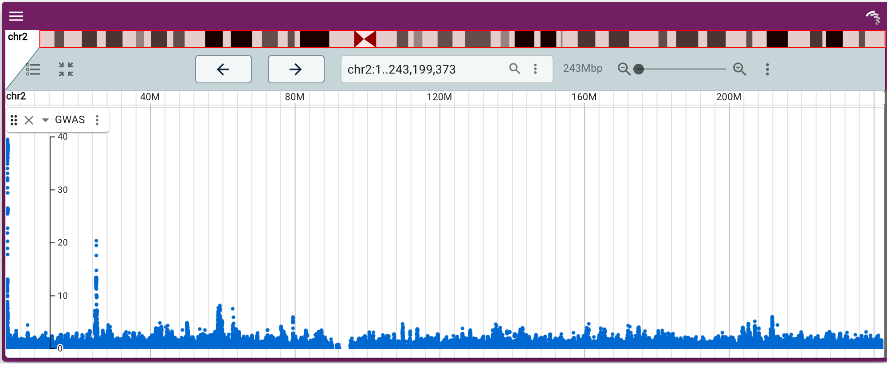
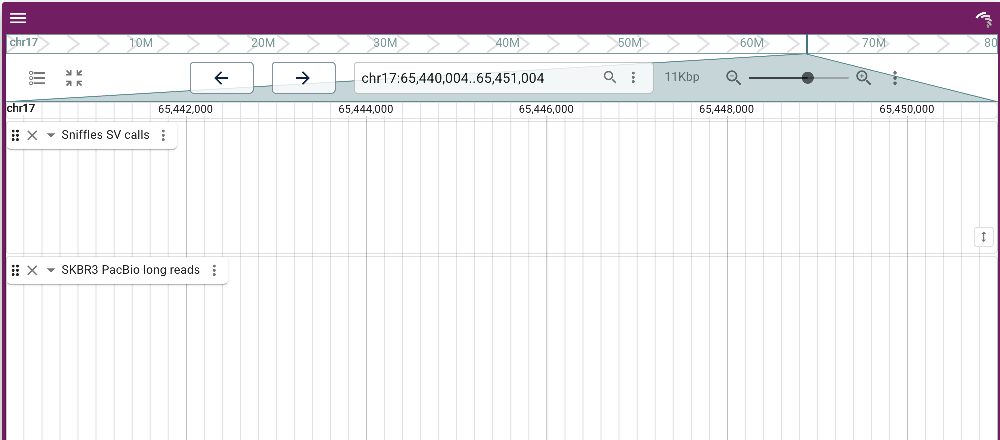
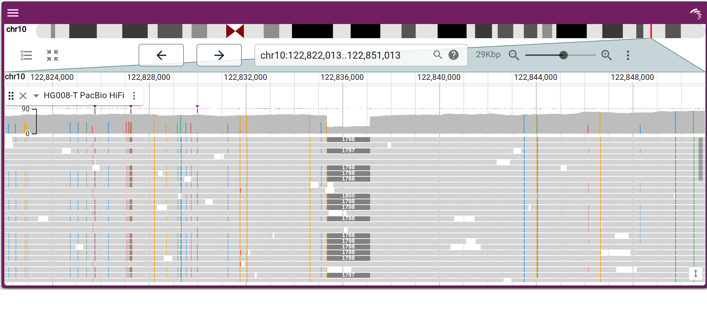
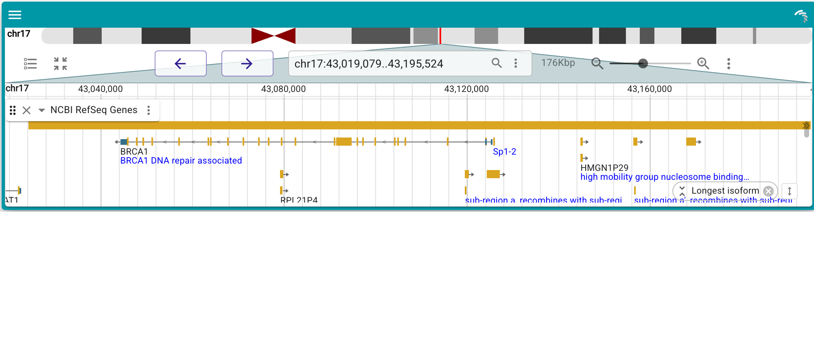

```{r, echo=FALSE, include=FALSE}
knitr::opts_chunk$set(eval = FALSE)
```

JBrowseR renders the [JBrowse 2](https://jbrowse.org/jb2/) linear genome view as
an htmlwidget. JBrowse 2 is a fast, GPU-accelerated genome browser; JBrowseR
lets you drive it entirely from R and embed it in R Markdown documents, Shiny
apps, or the interactive console.

The API is *declarative*. You describe the browser with plain values — a genome,
a list of tracks, a location — and helper constructors assemble the config. You
never build JSON by hand.

```{r setup}
library(JBrowseR)
```

## The one-liner

The fastest way in is to name a genome hub hosted at jbrowse.org. This gives you
the assembly, reference-name aliases, cytobands, and gene-name search with no
further setup:

```{r}
JBrowseR("hg38", location = "BRCA1")
```

`location` accepts a region string like `"chr1:1-10000"` or, because the hub
ships a search index, a gene name like `"BRCA1"`. Other hubs work the same way —
`"hg19"`, `"mm10"`, or a GenArk accession such as `"GCF_000001405.40"`.

## Adding tracks

Add tracks by URL with `track()`. The track type and its index files
(`.bai`/`.crai`/`.tbi`) are inferred from the file extension, so a data URL is
usually all you need. `tracks()` gathers several together.

```{r}
JBrowseR(
  "hg38",
  tracks = tracks(
    track(
      "https://jbrowse.org/genomes/GRCh38/alignments/NA12878/NA12878.alt_bwamem_GRCh38DH.20150826.CEU.exome.cram",
      name = "NA12878 Exome"
    )
  ),
  location = "17:43,044,295..43,048,000"
)
```


Recognized extensions cover the common genomics types:

| Extension | Track | Adapter |
|---|---|---|
| `.bam`, `.cram` | alignments | `BamAdapter`, `CramAdapter` |
| `.vcf.gz` | variants | `VcfTabixAdapter` |
| `.gff.gz`, `.gff3.gz`, `.gtf.gz`, `.bed.gz` | features | `Gff3TabixAdapter`, `GtfTabixAdapter`, `BedTabixAdapter` |
| `.bb`, `.bigBed` | features | `BigBedAdapter` |
| `.bw`, `.bigWig` | quantitative | `BigWigAdapter` |
| `.hic` | Hi-C contact matrix | `HicAdapter` |

The list isn't hard-coded in R — the view infers the adapter with JBrowse's own
format plugins, so any format a bundled plugin recognizes works. Anything the
inference gets wrong, or a track needing a specific adapter, is a plain config
list (the full JBrowse track JSON); extra arguments to `track()` (e.g.
`type = "AlignmentsTrack"`) ride onto the track and override the inferred
defaults.

When you only need the defaults, a bare URL string is a track — `track()` is
just the same thing with room for `name=` and extra config. So a whole browser
can skip the constructor entirely:

```{r}
JBrowseR(
  "hg38",
  tracks = list(
    "https://hgdownload.soe.ucsc.edu/goldenPath/hg38/phyloP100way/hg38.phyloP100way.bw",
    "https://jbrowse.org/genomes/GRCh38/ncbi_refseq/GCA_000001405.15_GRCh38_full_analysis_set.refseq_annotation.sorted.gff.gz"
  ),
  location = "BRCA1"
)
```

Index files (`.bai`/`.crai`/`.tbi`) default to the conventional sibling of the
data URL. When yours lives elsewhere — or is a `.csi` index — name it with
`index=`, or as the second element of a `c(url, index)` pair in `tracks`:

```{r}
track("https://example.com/reads.bam", index = "https://example.com/reads.bai")
```

## A gallery

The figures below are screenshots, so this vignette stays within CRAN's size
limits. Every one of them is also on the website as a
[live, interactive browser](https://gmod.github.io/JBrowseR/articles/live-browser.html).

**Genes.** A gene annotation track over the hub assembly, navigated by name.

```{r}
JBrowseR(
  "hg38",
  tracks = tracks(track(
    "https://jbrowse.org/genomes/GRCh38/ncbi_refseq/GCA_000001405.15_GRCh38_full_analysis_set.refseq_annotation.sorted.gff.gz",
    name = "NCBI RefSeq Genes"
  )),
  location = "BRCA1"
)
```



**Variants.** A 1000 Genomes VCF.

```{r}
JBrowseR(
  "hg38",
  tracks = tracks(track(
    "https://jbrowse.org/genomes/GRCh38/variants/ALL.wgs.shapeit2_integrated_snvindels_v2a.GRCh38.27022019.sites.vcf.gz",
    name = "1000 Genomes Variants"
  )),
  location = "17:43,045,000..43,046,800"
)
```



**Quantitative.** A phyloP conservation bigWig.

```{r}
JBrowseR(
  "hg38",
  tracks = tracks(track(
    "https://hgdownload.soe.ucsc.edu/goldenPath/hg38/phyloP100way/hg38.phyloP100way.bw",
    name = "phyloP100way Conservation"
  )),
  location = "17:43,044,295..43,048,000"
)
```



**Plots from a display.** A track's *display* can plot its data: a `GWASTrack`
with a `LinearManhattanDisplay` draws genome-wide summary statistics as a
Manhattan plot right in the linear view, so no separate plotting widget is
needed. Write the track as a config list — the same JSON a JBrowse config file
holds — and let the `uri` shorthand find the `.tbi` index.

```{r}
JBrowseR(
  "hg19",
  tracks = list(list(
    type = "GWASTrack",
    trackId = "gwas_track",
    name = "GWAS",
    adapter = list(
      type = "GWASAdapter",
      scoreColumn = "neg_log_pvalue",
      uri = "https://jbrowse.org/genomes/hg19/gwas/summary_stats.txt.gz"
    ),
    displays = list(list(type = "LinearManhattanDisplay", height = 250))
  )),
  location = "2"
)
```



**Your R results.** Turn a data frame of features into a track with
`track_data_frame()` — no files and no web server. Any `score` column makes it a
quantitative track.

```{r}
peaks <- data.frame(
  chrom = "17",
  start = seq(43000000, 43120000, by = 12000),
  end   = seq(43000000, 43120000, by = 12000) + 4000,
  name  = paste0("peak", 1:11),
  score = round(runif(11, 5, 100))
)

JBrowseR(
  "hg38",
  tracks = list(track_data_frame(peaks, "R_peaks")),
  location = "17:43,000,000..43,125,000"
)
```


**Cancer structural variants.** The SKBR3 breast-cancer cell line has a heavily
rearranged genome. PacBio long reads span breakpoints short reads cannot, and
Sniffles calls the structural variants from them. This view lands on a
translocation from chr17 to chr20 (`<TRA> 20:61,039,934`): the call sits in the
Sniffles track and the long reads carry it below.

```{r}
JBrowseR(
  "hg19",
  tracks = tracks(
    track(
      "https://jbrowse.org/genomes/hg19/SKBR3/reads_lr_skbr3.fa_ngmlr-0.2.3_mapped.bam.sniffles1kb_auto_l8_s5_noalt.filtered.vcf.gz",
      name = "Sniffles SV calls"
    ),
    track(
      "https://jbrowse.org/genomes/hg19/skbr3/reads_lr_skbr3.fa_ngmlr-0.2.3_mapped.down.bam",
      name = "SKBR3 PacBio long reads"
    )
  ),
  location = "17:65,440,000..65,451,000"
)
```



**A somatic deletion.** HG008-T is a tumor reference sample; its PacBio HiFi reads
carry a ~1.8 kb somatic deletion in *CUZD1*, visible as a clean drop-out spanning
many reads.

```{r}
JBrowseR(
  "hg38",
  tracks = tracks(track(
    "https://jbrowse.org/demos/cgiab/HG008-T_chr10_CUZD1_deletion.bam",
    name = "HG008-T PacBio HiFi"
  )),
  location = "10:122,822,000..122,851,000"
)
```



**A custom theme.** `theme()` recolors the browser.

```{r}
JBrowseR(
  "hg38",
  tracks = tracks(track(
    "https://jbrowse.org/genomes/GRCh38/ncbi_refseq/GCA_000001405.15_GRCh38_full_analysis_set.refseq_annotation.sorted.gff.gz",
    name = "NCBI RefSeq Genes"
  )),
  theme = theme("#311b92", "#0097a7"),
  location = "BRCA1"
)
```



## Where to next

- A genome that isn't on a hub? See the
  [custom browser tutorial](custom-browser-tutorial.html).
- Files on your own machine? See [serving local data](creating-urls.html).
- Need full control? Pass a whole JBrowse config with the
  [`config` escape hatch](json-tutorial.html).
- Embedding in Shiny? Use `JBrowseROutput()` and `renderJBrowseR()`, and read
  the selected feature back with `input$selectedFeature`.
