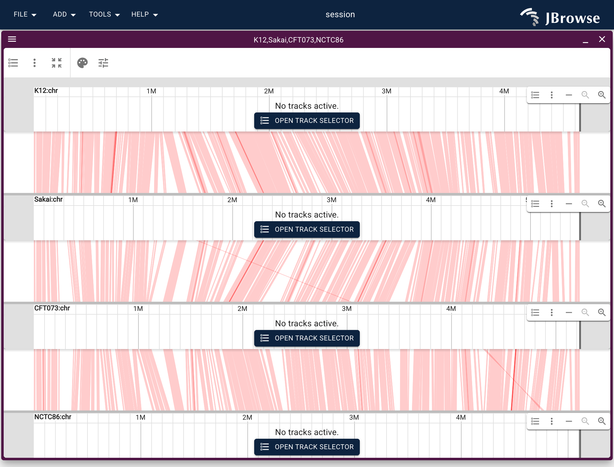
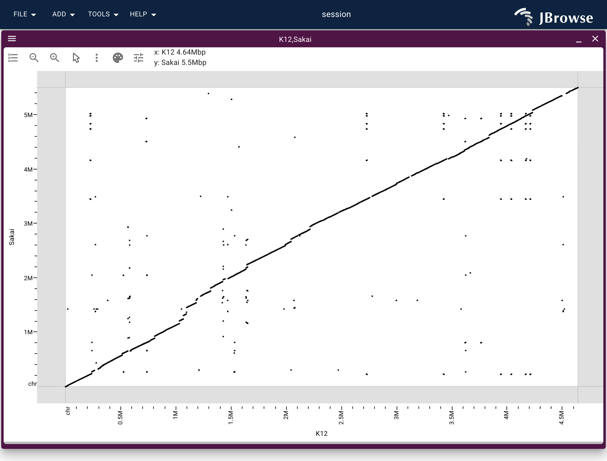

```{r, echo=FALSE, include=FALSE}
knitr::opts_chunk$set(eval = FALSE)
```

`JBrowseR()` renders a single linear genome view. For comparative genomics —
several genomes stacked, the blocks each pair shares drawn between the rows —
`JBrowseRApp()` drives the full app from a declarative `views` list, where each
entry can be a `linear_view()`, a `synteny_view()`, or a `dotplot_view()`.

This vignette stacks four *E. coli* strains (K12, Sakai, CFT073, NCTC86) tied
together by one all-vs-all minimap2 alignment — the same hosted data as the
JBrowse [all-vs-all synteny
tutorial](https://jbrowse.org/jb2/docs/tutorials/allvsall_synteny/).

The website hosts the [same views as live widgets](https://gmod.github.io/JBrowseR/articles/synteny.html), and everything
here also runs on Colab's R runtime:
[](https://colab.research.google.com/github/GMOD/JBrowseR/blob/main/examples/JBrowseR_comparative_colab.ipynb)

```{r setup}
library(JBrowseR)
```

## Describe the four assemblies

An assembly is the flat `list(name = , uri = )` shorthand JBrowse expands
itself — it picks the adapter from the extension and derives the `.fai`/`.gzi`
index locations, so the URL is all you write. (`assembly()` is the same thing
with the name defaulted from the file.)

```{r}
base <- "https://jbrowse.org/demos/ecoli_pangenome"
strains <- c("K12", "Sakai", "CFT073", "NCTC86")

assemblies <- lapply(strains, function(s) {
  list(name = s, uri = paste0(base, "/", s, ".fa.gz"))
})
```

## One all-vs-all track between them

A single `AllVsAllPAFAdapter` track serves every pair from one PAF file. It spans
all four assemblies, so `synteny_track()` (which builds the two-assembly PAF
case) does not apply — write the track config as a plain list, the same JSON a
JBrowse config file would hold.

```{r}
ecoli_ava <- list(
  type = "SyntenyTrack",
  trackId = "ecoli_ava",
  name = "E. coli all-vs-all (minimap2 PAF)",
  assemblyNames = as.list(strains),
  adapter = list(
    type = "AllVsAllPAFAdapter",
    assemblyNames = as.list(strains),
    pafLocation = list(uri = paste0(base, "/all_vs_all.paf.gz"))
  )
)
```

## Stack them in a synteny view

`synteny_view()` takes the assembly names top-to-bottom. The four rows have three
gaps between adjacent pairs, and each gap draws the same all-vs-all track, so
`tracks` is that trackId once per gap. `draw_curves = FALSE` draws straight
ribbons; `min_alignment_length` hides short, noisy blocks.

```{r}
app <- JBrowseRApp(
  assemblies = assemblies,
  tracks = list(ecoli_ava),
  views = list(
    synteny_view(
      as.list(strains),
      tracks = list(list("ecoli_ava"), list("ecoli_ava"), list("ecoli_ava")),
      drawCurves = FALSE,
      minAlignmentLength = 10000
    )
  )
)
app
```



In the console this opens a browser tab; in R Markdown it renders inline; in
Shiny, pair `JBrowseROutput()` with `renderJBrowseR()`.

## The same PAF as a dotplot

Any one pair opens whole-genome as a dotplot — the long diagonal is the shared
backbone, off-diagonal segments are rearrangements.

```{r}
JBrowseRApp(
  assemblies = assemblies[1:2],
  tracks = list(ecoli_ava),
  views = list(dotplot_view(list("K12", "Sakai"), tracks = list("ecoli_ava")))
)
```



## Building the PAF from your own genomes

The hosted `all_vs_all.paf.gz` comes from concatenating the strains (each contig
PanSN-named `sample#1#contig`) and running `minimap2 -c -x asm20 --eqx` all
pairs. The
[tutorial](https://jbrowse.org/jb2/docs/tutorials/allvsall_synteny/) walks
through generating it and loading per-strain gene tracks alongside.
